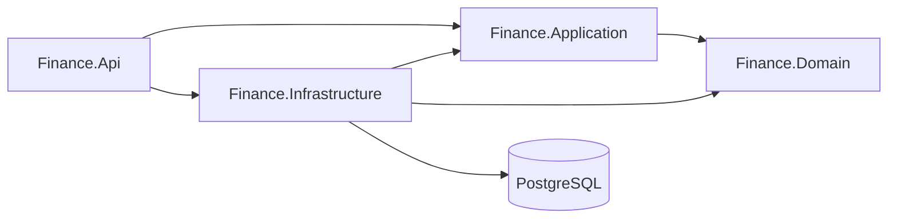

# Finance: Personal Expense Tracker

[](https://github.com/HamadSMA/expense-tracker/actions/workflows/ci.yml)

A multi-user expense tracker REST API: log spending, categorise it, see where the money went.
Built with ASP.NET Core 10, Clean Architecture, PostgreSQL and Keycloak. The project intentionally keeps the domain small to focus on backend engineering concerns: authentication and authorization, data isolation, query composition, validation, database integration, automated testing, containerization, and CI/CD.


**Status:** backend complete, including authentication, per-user authorization, automated unit/integration testing, Docker Compose, and GitHub Actions CI/CD. Remaining enhancements are structured logging, health checks, and a frontend as a stretch goal.

## Tech Stack

| | |
| --- | --- |
| **Backend** | C#, .NET 10, ASP.NET Core Web API |
| **Data** | PostgreSQL, EF Core 10 + Npgsql, code-first migrations |
| **Auth** | Keycloak, OIDC / OAuth 2.0, JWT bearer validation |
| **API** | REST, OpenAPI, Scalar, RFC 7807 ProblemDetails |
| **Architecture** | Clean Architecture, 4 projects |
| **Testing** | xUnit, WebApplicationFactory, Testcontainers (PostgreSQL) |
| **Infrastructure** | Docker, Docker Compose, GitHub Actions, GitHub Container Registry |

## Key Features

- **Secure by default:** Keycloak-issued JWTs, and every query is scoped to the signed-in
  user, so nobody can read or change another user's data
- **Filtering, sorting and pagination** on the expense list
- **Dashboard aggregation in SQL:** totals, spend by category, top expenses and spend over time
- **Validation and consistent errors:** RFC 7807 ProblemDetails, no stack traces leaked
- **Tested against a real database:** integration tests run on PostgreSQL via Testcontainers
- **CI/CD:** every push builds, runs all tests and publishes a Docker image

## Architecture


```mermaid
flowchart LR
    Api[Finance.Api] --> Application[Finance.Application]
    Api --> Infrastructure[Finance.Infrastructure]
    Infrastructure --> Application
    Infrastructure --> Domain[Finance.Domain]
    Application --> Domain
    Infrastructure --> Db[(PostgreSQL)]
```

| Project | Contains |
| --- | --- |
| `Finance.Api` | Controllers, auth, composition root |
| `Finance.Infrastructure` | EF Core, Npgsql, migrations |
| `Finance.Application` | DTOs, validation rules, `IFinanceDbContext` |
| `Finance.Domain` | Entities, category list; references nothing |

The domain references no framework or infrastructure libraries, keeping business rules independent from persistence and identity providers. Authentication and persistence concerns are isolated from the domain.

## API

All endpoints except `/api/categories` require `Authorization: Bearer <token>`.

| Method | Route | Description |
| --- | --- | --- |
| GET | `/api/expenses` | List (filtered, sorted, paged) |
| GET | `/api/expenses/{id}` | Fetch one |
| POST | `/api/expenses` | Create |
| PUT | `/api/expenses/{id}` | Update |
| DELETE | `/api/expenses/{id}` | Delete |
| GET | `/api/dashboard/summary` | Total, count, average, largest |
| GET | `/api/dashboard/by-category` | Spend per category, with % of total |
| GET | `/api/dashboard/by-day` | Spend over time, auto-bucketed |
| GET | `/api/dashboard/top-expenses` | 10 largest |
| GET | `/api/categories` | The 9 fixed categories |


Full request and response documentation is served by Scalar at
[`/scalar/v1`](http://localhost:5048/scalar/v1) when running locally.

## Running with Docker Compose

Requires Docker.

```bash
cp .env.example .env
docker compose up --build -d
```

This starts three containers:

| Service | Port | Notes |
| --- | --- | --- |
| `api` | `5048` | Runs in Production, so Scalar is not mapped |
| `db` | `5433` | PostgreSQL 18; data kept in the `db-data` volume |
| `keycloak` | `8080` | Imports the `finance` realm from `keycloak/finance-realm.json` on first start |

On first start, PostgreSQL runs `database-init.sql`, which creates the schema and seeds the
categories, so no `dotnet ef` step is needed. The script only runs against an empty volume;
to start over, run `docker compose down -v`.

### Test user

The realm import also creates a demo user, `testuser` / `password`, with a complete profile,
so you can request a token straight away. These credentials are for local use only.

Request a token and call the API:

```bash
TOKEN=$(curl -s -X POST http://localhost:8080/realms/finance/protocol/openid-connect/token \
  -d grant_type=password -d client_id=finance-web \
  -d username=testuser -d password=password | jq -r .access_token)

curl -H "Authorization: Bearer $TOKEN" http://localhost:5048/api/expenses
```

## Running Locally

To run the API with `dotnet run` outside Docker Compose, see
[docs/local-setup.md](docs/local-setup.md). It covers Keycloak, configuration, the database
and the included REST Client and Postman test suites.

## Testing

```bash
dotnet test
```

The integration tests need Docker running; the unit tests do not.

| Project | Covers |
| --- | --- |
| `Finance.UnitTests` | Expense validation rules in `Finance.Application`, no I/O |
| `Finance.IntegrationTests` | The full HTTP pipeline against a real PostgreSQL database |

The integration tests boot the API in memory with `WebApplicationFactory` against a
throwaway PostgreSQL container started by Testcontainers. Keycloak is swapped for a test
authentication handler, so tests can act as different users without issuing real tokens.

They cover:

- **Expenses:** CRUD, validation errors, filtering, sorting and pagination
- **Ownership:** another user's expenses return `404` on read, update and delete; no token
  returns `401`
- **Dashboard:** summary totals, spend by category and time series bucketing
- **Categories:** the public category list

## Roadmap

- [x] Core backend: Clean Architecture, EF Core, PostgreSQL, CRUD
- [x] Validation, filtering, sorting, pagination, dashboard aggregation
- [x] Security: Keycloak, OIDC, JWT bearer, per-user ownership
- [x] Unit and integration tests
- [x] Docker, Docker Compose and GitHub Actions CI
- [ ] Structured logging
- [ ] Health checks
- [ ] Frontend (optional)

## License

MIT. See [LICENSE](LICENSE).
