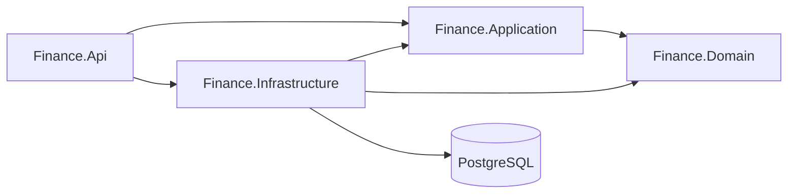

# Finance: Personal Expense Tracker

A multi-user expense tracker REST API: log spending, categorise it, see where the money went.
Built with ASP.NET Core 10, Clean Architecture, PostgreSQL and Keycloak. The domain is
deliberately small (amounts in SAR; no multi-currency, accounts, budgets or transfers) so the
engineering around it can be the interesting part.

**Status:** backend complete through Phase 3 (secured API), with unit and integration tests
from Phase 4 in place. The full stack (API, PostgreSQL, Keycloak) now runs with Docker Compose.
Structured logging, health checks and CI are next.

## Tech Stack

| | |
| --- | --- |
| **Backend** | C#, .NET 10, ASP.NET Core Web API |
| **Data** | PostgreSQL, EF Core 10 + Npgsql, code-first migrations |
| **Auth** | Keycloak, OIDC / OAuth 2.0, JWT bearer validation |
| **API** | REST, OpenAPI, Scalar, RFC 7807 ProblemDetails |
| **Architecture** | Clean Architecture, 4 projects |
| **Testing** | xUnit, WebApplicationFactory, Testcontainers (PostgreSQL) |
| **Infrastructure** | Docker, Docker Compose |

## Key Features

- **Per-user data isolation:** every query is scoped to the user in the JWT; no cross-user reads
- **JWT bearer auth:** signature, issuer, audience and expiry validated against Keycloak's
  discovery document; issuer configured, never hardcoded
- **Filtering, sorting, pagination:** category, amount range, date range and description
  search; sort by date, amount or created-at; paged envelope with total count
- **Dashboard aggregation in SQL:** totals, spend by category with percentages, top expenses,
  and spend over time with adaptive day/week/month bucketing
- **Validation:** positive amounts, max 2 decimal places, no future dates, known category,
  description length
- **Consistent errors:** RFC 7807 ProblemDetails; no stack traces or database detail leaked
- **API documentation:** OpenAPI generated from XML doc comments, browsable in Scalar with
  bearer auth built in

**Not built yet:** structured logging, health checks, CI, frontend.

## Architecture


```mermaid
flowchart LR
    Api[Finance.Api] --> Application[Finance.Application]
    Api --> Infrastructure[Finance.Infrastructure]
    Infrastructure --> Application
    Infrastructure --> Domain[Finance.Domain]
    Application --> Domain
    Infrastructure --> Db[(PostgreSQL)]
```

| Project | Contains |
| --- | --- |
| `Finance.Api` | Controllers, auth, composition root |
| `Finance.Infrastructure` | EF Core, Npgsql, migrations |
| `Finance.Application` | DTOs, validation rules, `IFinanceDbContext` |
| `Finance.Domain` | Entities, category list; references nothing |

Arrows are project references. The domain references no framework (no ASP.NET Core, no EF
Core, no provider SDKs), so persistence and identity are swappable without touching business
rules. Swapping Keycloak for Entra ID is a configuration change, not a code change.

## API

All endpoints except `/api/categories` require `Authorization: Bearer <token>`.

| Method | Route | Description |
| --- | --- | --- |
| GET | `/api/expenses` | List (filtered, sorted, paged) |
| GET | `/api/expenses/{id}` | Fetch one |
| POST | `/api/expenses` | Create |
| PUT | `/api/expenses/{id}` | Update |
| DELETE | `/api/expenses/{id}` | Delete |
| GET | `/api/dashboard/summary` | Total, count, average, largest |
| GET | `/api/dashboard/by-category` | Spend per category, with % of total |
| GET | `/api/dashboard/by-day` | Spend over time, auto-bucketed |
| GET | `/api/dashboard/top-expenses` | 10 largest |
| GET | `/api/categories` | The 9 fixed categories |

Status codes: `200` / `201` / `204` on success, `400` validation, `401` missing or invalid
token, `404` not found or not yours.

Full request and response documentation is served by Scalar at
[`/scalar/v1`](http://localhost:5048/scalar/v1) when running locally.

## Running with Docker Compose

Requires Docker and the EF Core CLI.

```bash
cp .env.example .env
docker compose up --build -d
dotnet ef database update --project src/Finance.Infrastructure --startup-project src/Finance.Api \
  --connection "Host=localhost;Port=5433;Database=finance;Username=finance;Password=<POSTGRES_PASSWORD from .env>"
```

This starts three containers:

| Service | Port | Notes |
| --- | --- | --- |
| `api` | `5048` | Runs in Production, so Scalar is not mapped |
| `db` | `5433` | PostgreSQL 18; data kept in the `db-data` volume |
| `keycloak` | `8080` | Imports the `finance` realm from `keycloak/finance-realm.json` on first start |

The migration step creates the schema and seeds the categories; the API does not migrate on
startup. The realm export contains no users, so create one in the Keycloak admin console
(password with **Temporary** off, plus first name, last name and email) before requesting a
token.

## Running Locally

Requires .NET SDK 10, PostgreSQL 14+, Docker and the EF Core CLI.

```bash
cp src/Finance.Api/appsettings.Example.json src/Finance.Api/appsettings.json
dotnet ef database update --project src/Finance.Infrastructure --startup-project src/Finance.Api
dotnet run --project src/Finance.Api
```

The API also needs a Keycloak realm to issue tokens. See
[docs/local-setup.md](docs/local-setup.md) for the Keycloak setup, configuration details and
the included REST Client and Postman test suites.

## Testing

```bash
dotnet test
```

The integration tests need Docker running; the unit tests do not.

| Project | Covers |
| --- | --- |
| `Finance.UnitTests` | Expense validation rules in `Finance.Application`, no I/O |
| `Finance.IntegrationTests` | The full HTTP pipeline against a real PostgreSQL database |

The integration tests boot the API in memory with `WebApplicationFactory` and point it at a
throwaway `postgres:18` container started by Testcontainers, with migrations applied on
startup. One container is shared across the whole suite through an xUnit collection fixture.
Keycloak is swapped for a test authentication handler that builds the user from an
`X-Test-Sub` header, so tests can act as different users without issuing real tokens.

They cover:

- **Expenses:** CRUD, validation errors, filtering, sorting and pagination
- **Ownership:** another user's expenses return `404` on read, update and delete; no token
  returns `401`
- **Dashboard:** summary totals, spend by category and time series bucketing
- **Categories:** the public category list

## Roadmap

- [x] **Phase 1, Core Backend:** Clean Architecture, EF Core, PostgreSQL, CRUD, ProblemDetails
- [x] **Phase 2, Real API:** validation, filtering, sorting, pagination, dashboard aggregation
- [x] **Phase 3, Security:** Keycloak, OIDC, JWT bearer, per-user ownership
- [x] **Phase 4, Quality:** ~~xUnit unit tests~~, ~~Testcontainers integration tests~~, structured
  logging, health checks
- [ ] **Phase 5, Infrastructure:** ~~Dockerfile~~, ~~Docker Compose for the full stack~~, GitHub
  Actions CI
- [ ] **Phase 6, Optional:** Azure Container Apps, Entra ID, Redis, OpenTelemetry, rate limiting
- [ ] **Phase 7, Optional Frontend:** React, TypeScript, OIDC login, expense UI, charts

## License

MIT. See [LICENSE](LICENSE).
